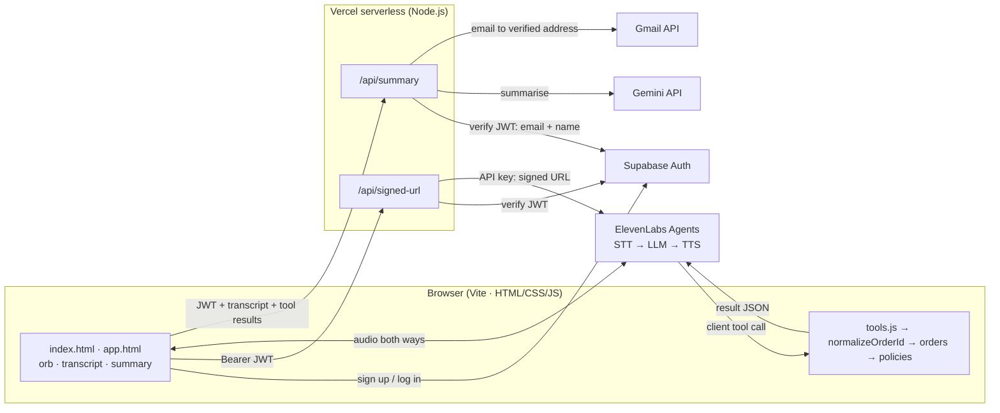

# Aria — AI Voice CX Agent for Aura Skincare

> 🔗 **Live app:** https://aura-voice-agent-sandy.vercel.app · 🎥 **Demo video:**  https://drive.google.com/drive/folders/1-FLfmlgb5cXPBv7xChazm54mJg4xbJsm?usp=sharing · 💼 

A browser-based voice customer-support agent for Aura Skincare, a fictional Indian D2C skincare brand. Sign up, click **Start call**, and talk to Aria. She greets you by name, looks up orders, follows brand policy (and politely refuses what it doesn't allow), handles unclear or invalid order IDs without inventing anything, and when the call ends you get a transcript plus a structured summary, on screen and by email.

## Approach
I let a managed voice platform (ElevenLabs Agents) handle the hard real-time parts — speech-to-text, turn-taking, interruptions, text-to-speech — and spent my time on what makes a support agent trustworthy: **policy decisions are made in code, not by the LLM**. The order tools return pre-computed eligibility (can it be cancelled? is it inside the return window?), the code re-checks before any action, and the post-call summary is forced to agree with what the tools actually did. Everything secret lives in two small serverless functions that verify the user's login before doing anything.

## How to test (evaluators)
1. Open the **[live app](https://aura-voice-agent-sandy.vercel.app)** and **sign up** with your name and email. Signup is instant (no confirmation email). Returning users log in.
2. Click **Start call** and allow the microphone. Aria greets you by your first name.
3. Use the **Test orders** panel (click a card to copy its ID). Each order is a different policy trap:

   | Say | What should happen |
   |---|---|
   | "Where is my order ORD-101?" | Out for delivery with BlueDart, by 6 PM today; Aria mentions it's under Priya Sharma's name |
   | "Can I cancel ORD-101?" | Declined: already out for delivery, but you can refuse it at the doorstep |
   | "I opened ORD-102, can I return it?" | Declined: delivered 14 days ago, outside the 7-day window (and opened) |
   | "Please cancel ORD-103" → "yes" | Cancelled; the Test orders card switches to **Cancelled** |
   | "Check order ORD-999" / "order one oh one" | Not found → asks you to verify / spoken ID normalised to ORD-101 |
   | "Book me a flight to Goa" | Politely stays on Aura Skincare topics |

4. Say **"that's all"** (Aria ends the call) or click **End call**. The transcript stays on the page, the summary appears, and it's **emailed to your signup address — please check spam**.
5. The structured JSON summary is logged in DevTools → Console as `[summary] JSON:`.

## Features
- **Voice call in the browser** with a live state indicator: Ready → Connecting → Listening → Thinking → Speaking → Call ended. The orb reacts to the live voice volume.
- **Personalised:** Aria greets the signed-in user by first name and uses it only at the start and end of the call.
- **Two client tools:** `get_order_details` (status, courier, tracking, cancel/return/damage eligibility) and `cancel_order` (re-checks policy in code before acting).
- **Robust order IDs:** "ORD 101", "ord101", "order one oh one", "O R D one zero one" and "101" all resolve to `ORD-101`; unknown or garbled IDs return no data, so there's nothing to hallucinate from.
- **Policy guardrails in three layers:** prompt, code (`policies.js`), and data (facts only from tools).
- **Live transcript** as chat bubbles; **post-call summary** (intent, order, resolution, policy, sentiment, action items, duration) generated by Gemini, validated against a fixed schema, and **emailed** via the Gmail API.
- **Mandatory sign up / log in** (Supabase Auth); the call page is protected.
- **Security:** private agent (signed URLs only for logged-in users), all keys server-side, recipient email taken from the verified login token.
- **Resilience:** Gemini model fallback chain, a rule-based summary if every model is down, email failure never hides the summary, clear messages for blocked microphones and dropped connections.
- **123 automated tests** (`npm test`) covering ID normalisation, policies and their boundaries, both tools, the call state machine, form validation, summary validation, the email template (HTML-injection safe), and both API functions with the network faked.

## Architecture



**One turn of the call:** the mic streams to ElevenLabs → speech-to-text → turn detection → the LLM reads the system prompt (with `{{user_name}}` filled in) and either replies or calls a tool → the tool runs **in the browser** and returns pre-computed eligibility → text-to-speech streams back. If you talk over Aria, she stops (barge-in).

**After the call:** the browser sends the transcript plus the tools' actual results to `/api/summary`, which verifies the Supabase token, asks Gemini for JSON, validates every field, makes the outcome agree with the verified tool results (a real cancellation is always "Resolved"), emails it, and returns it.

Full details: [docs/ARCHITECTURE.md](docs/ARCHITECTURE.md) · every design decision with trade-offs: [docs/DECISIONS.md](docs/DECISIONS.md).

## Tech stack
HTML, CSS, JavaScript (ES modules, Vite) · Supabase Auth · ElevenLabs Agents (`@elevenlabs/client`) · Google Gemini API · Gmail API · Vercel (hosting + serverless functions). Server calls to Gemini, Gmail and Supabase use Node's built-in `fetch` — no extra SDKs.

## Run locally
```bash
git clone https://github.com/LakshyaKarkera12/aura-voice-agent.git
cd aura-voice-agent
npm install
cp .env.example .env.local   # fill in real values (see below)
npm run check:env            # verifies every key works, never prints them
npm i -g vercel && vercel login
vercel dev                   # site + /api functions on http://localhost:3000
npm test                     # 123 offline tests
```
- **Supabase:** create a project, Email provider on, **Confirm email off**; copy the Project URL (no `/rest/v1/`) and the publishable/anon key.
- **ElevenLabs:** create the agent from [docs/SYSTEM_PROMPT.md](docs/SYSTEM_PROMPT.md) (two client tools + `user_name` dynamic variable), then `npm run sync:agent` keeps the dashboard prompt identical to the doc. API key needs **ElevenLabs Agents: Write** (for signed URLs).
- **Gemini:** an API key from Google AI Studio.
- **Gmail:** follow [docs/GMAIL_SETUP.md](docs/GMAIL_SETUP.md).

## Project structure
```
index.html, app.html          Sign up / log in page · call page (protected)
src/js/
  voice.js                    ElevenLabs session + call state machine + voice levels
  tools.js                    client tools: get_order_details, cancel_order
  orders.js                   mock order store (dates relative to now; remembers cancellations)
  normalizeOrderId.js         "order one oh one" → ORD-101
  policies.js                 canCancel, isReturnEligible, isDamageClaimEligible, shippingFee, codAllowed
  app.js                      wires the call page: session guard, orb, transcript, summary, Test orders
  auth.js, validation.js      sign up / log in, form rules, friendly auth errors
  supabaseClient.js           browser Supabase client (public URL + publishable key only)
  transcript.js, summaryView.js, summarySchema.js
src/styles/                   base.css (tokens, shared), auth.css, app.css
api/
  signed-url.js               verify JWT → ElevenLabs signed URL
  summary.js                  verify JWT → Gemini summary → Gmail → JSON
server/                       verifyUser, gemini (model chain + validation), gmail (MIME + send), emailTemplate
scripts/                      check-env (key checker), sync-agent (push prompt to ElevenLabs)
tests/                        node:test suites (no extra packages)
docs/                         plan, architecture, decisions, prompt, test scenarios, UI design
```

## How I think (Section 9)

### 1. Why this architecture and stack?
- **ElevenLabs Agents** for the voice pipeline: strong Indian English voices, built-in turn-taking and barge-in, client tools that run in the browser, and dynamic variables for per-user personalisation. Building STT + LLM + TTS myself would have spent the deadline on turn detection and echo handling instead of on support quality. Trade-off: vendor lock-in and per-minute cost.
- **Plain HTML/CSS/JS with Vite**, no framework: two pages don't need React, and I can explain every line.
- **Vercel serverless functions** give a tiny backend in the same repo for the only things that need secrets (signed URLs, Gemini, Gmail). Each verifies the Supabase JWT first and takes the email from the token, never the request body — otherwise the API would be an open email relay.
- **Policy in code, not only in the prompt:** an LLM can be argued into "just this once" or miscount 14 vs 7 days; code can't. The LLM only phrases the decision.

### 2. Hardest part and how I solved it
The hardest part was making the system *trustworthy* rather than just working — several bugs only showed up in real use:
- **The summary contradicted reality.** A successful cancellation was summarised as "Unresolved" because the summary only saw the transcript. I now send the tools' verified results with the transcript and enforce them in code after the LLM runs, so the summary can't disagree with what actually happened.
- **The LLM provider was intermittently overloaded (HTTP 503),** and a busy model could take 30+ seconds just to fail, which produced an empty "couldn't be generated" email. I added a model fallback chain with short per-attempt timeouts, and a rule-based summary built from the transcript as the last resort.
- **Calls dropped while scrolling.** The cause was in my own focus management: after Start call, keyboard focus moved to End call, so pressing Space to scroll "clicked" it. I moved focus to a non-interactive element and also told the agent never to hang up on silence.

Each fix came with a test that reproduces the failure.

### 3. One more week: what I'd improve first
1. **Identity verification** (phone + OTP) before revealing order details; today any logged-in user can look up the mock orders.
2. **A real orders backend** with authorisation, and persisted cancellations.
3. **Automated evaluation of calls:** replay recorded test conversations and score tool use, policy adherence and hallucinations on every prompt change.
4. **Human handoff** (escalation queue with the transcript attached) and a call history page.
5. **Single source of truth for policy:** generate the prompt's policy text from `policies.js` so they can't drift.

### 4. At 1,000 conversations a day
- **Cost & latency:** at ~3 minutes per call that's ~50 hours of voice per day; pick the voice/LLM tier per cost-per-minute and measure time-to-first-audio.
- **Real orders API** with auth, caching and rate limits instead of browser mock data; tools would move server-side (webhook tools) so order data is never shipped to the client.
- **Abuse protection:** per-user rate limits on calls and summaries, max call length, credit alerts.
- **Observability:** log latency, tool errors, failed lookups, fallback-model usage and hang-up reasons; dashboards and alerts.
- **Quality:** automated QA on a sample of transcripts; flag declined/unresolved calls for review.
- **PII:** retention rules for transcripts and emails, redaction in logs, a data-processing agreement with each vendor.
- **Email:** a transactional provider on a verified domain (Gmail API has daily sending limits and lands in spam).
- **Reliability:** provider concurrency limits and fallbacks, paid tiers so nothing pauses (Supabase free projects pause when idle).

## Known limitations
- Mock orders live in the browser bundle; a real system would query an orders API with authorisation.
- No identity verification before revealing order details (the mock data has no phone/OTP).
- Cancellation is simulated: remembered until the page is refreshed, not persisted.
- Email is sent from a personal Gmail account via the Gmail API (daily limits; may land in spam). The Google OAuth app is in Testing mode, so its refresh token is rotated weekly.
- Free tiers (ElevenLabs minutes, Supabase pausing) limit long-running availability.

More in [docs/ARCHITECTURE.md §9](docs/ARCHITECTURE.md).
